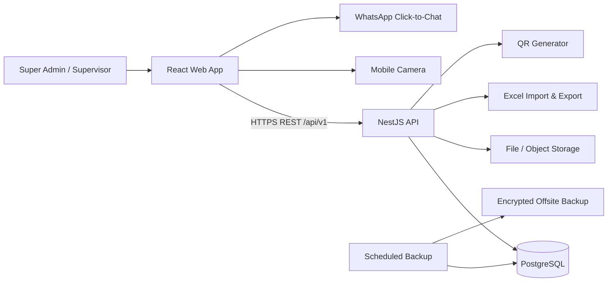
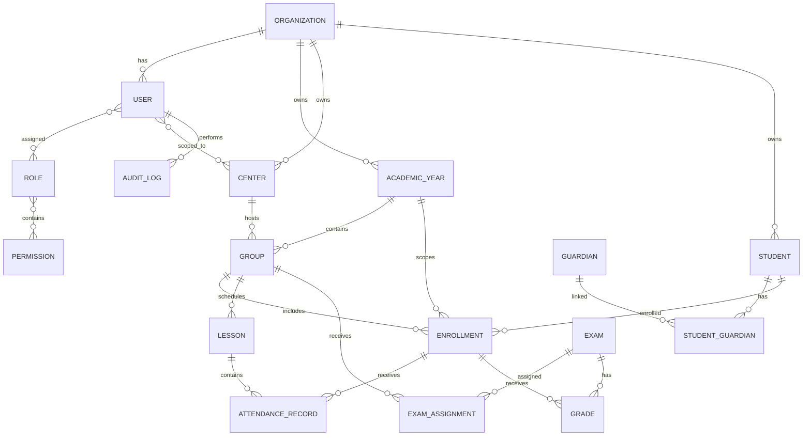

# مواصفات نظام إدارة ومتابعة الطلاب

> **اسم مبدئي للمشروع:** `[PROJECT_NAME]`  
> **نوع المشروع:** Web Application — Mobile First — Arabic RTL  
> **الإصدار:** Product & Technical Specification v1.0  
> **الجمهور المستهدف:** مدرس واحد بصفة Super Admin، ومشرفون يتابعون الطلاب والسناتر والحضور والدرجات والتواصل مع أولياء الأمور.  
> **الغرض من هذا الملف:** مرجع موحد للـUI/UX Designer، والـFrontend Developer، والـBackend Developer، والـQA، وأي AI سيقوم ببناء المشروع.

---

## طريقة استخدام الملف مع الـAI

1. أرفق هذا الملف كاملًا في بداية المحادثة أو داخل مستودع المشروع.
2. أرسل للـAI الشاشات المرجعية التي صممتها، واطلب منه أولًا استخراج Design Tokens وComponent Inventory، وليس بناء كل الصفحات مباشرة.
3. اطلب تنفيذ المشروع بالـPhases الموجودة في القسم 49، مرحلة واحدة في كل مرة.
4. بعد كل مرحلة اطلب تشغيل Typecheck وLint وTests وBuild، ثم تحديث `IMPLEMENTATION_STATUS.md`.
5. لا توافق على الانتقال للمرحلة التالية قبل أن تكون المرحلة الحالية قابلة للتشغيل ومتصلة بالـBackend الحقيقي.
6. عند اختلاف اقتراح الـAI عن هذه الوثيقة، يجب أن يشرح الفرق ويسجله كقرار ADR بدل تغييره بصمت.
7. احتفظ بالتصميمات الأصلية والملف داخل مجلد `docs/` في المشروع ليظلا مرجعًا ثابتًا.

> الأفضل عدم مطالبة الـAI بإنشاء المشروع الإنتاجي كاملًا في دفعة واحدة؛ التنفيذ المرحلي يجعل مراجعة الكود والاختبارات والأمان أسهل كثيرًا.

---

## 0. ملاحظة مهمة قبل التنفيذ

لا يوجد مشروع برمجي يمكن ضمان خلوه من الأخطاء بنسبة 100%. الهدف من هذه الوثيقة هو تقليل الأخطاء والمفاجآت لأقصى درجة عن طريق:

- تحديد المتطلبات وقواعد العمل قبل كتابة الكود.
- فرض قيود صحيحة داخل قاعدة البيانات، وليس داخل الواجهة فقط.
- توثيق حالات النجاح والفشل والـEdge Cases.
- إضافة اختبارات تلقائية للمسارات الحرجة.
- توفير نسخ احتياطية قابلة للاستعادة.
- فصل الواجهة عن منطق العمل وعن قاعدة البيانات.
- توحيد الـAPI والـErrors والصلاحيات.

أي تغيير في المتطلبات بعد بدء التنفيذ يجب تسجيله في قسم **قرارات المشروع** وتطبيقه عن طريق Migration واختبارات، وليس بتعديلات عشوائية مباشرة.

---

# 1. ملخص المشروع

النظام عبارة عن منصة ويب عربية تساعد المدرس والمشرفين على:

1. تسجيل الطلاب يدويًا أو استيرادهم من Excel.
2. إنشاء كود سهل وفريد لكل طالب تلقائيًا، مثل `ST-2026-0001`.
3. إنشاء QR Code آمن لكل طالب تلقائيًا.
4. إدارة السناتر والمجموعات ومواعيد الحصص.
5. تسجيل حضور الطلاب بسرعة من الموبايل عن طريق مسح QR Code.
6. تسجيل الحضور يدويًا بالكود أو الاسم عند تعذر الكاميرا.
7. إنشاء الامتحانات وإدخال درجات الطلاب ومتابعة تطور مستواهم.
8. فتح رسالة واتساب جاهزة لولي الأمر بدون WhatsApp API مدفوع.
9. عرض Dashboard وإحصائيات للطلاب والسناتر والحضور والدرجات.
10. تنزيل ملفات Excel حسب الفلاتر للاحتفاظ بنسخة Offline.
11. إدارة المشرفين بصلاحيات دقيقة ومحدودة.
12. الاحتفاظ بسجل Audit Log لكل العمليات الحساسة.
13. عمل نسخ احتياطية حقيقية لقاعدة البيانات، بجانب ملفات Excel.

---

# 2. المبادئ الأساسية للمشروع

## 2.1 قاعدة البيانات ليست Excel

Excel وسيلة ممتازة للاستيراد، التصدير، التقارير والنسخ المقروءة Offline، لكنه **ليس قاعدة البيانات الأساسية**؛ لأنه لا يناسب:

- الكتابة المتزامنة من أكثر من مستخدم.
- العلاقات بين الطلاب والسناتر والحصص والدرجات.
- الصلاحيات والأمان.
- منع التكرار والتعارض.
- Audit Logs.
- المعاملات Transactions.
- الاستعادة الدقيقة بعد الأعطال.

القرار المعتمد:

- **قاعدة البيانات الأساسية:** PostgreSQL.
- **Excel:** Import / Export / Offline Snapshot.
- **Database Backup:** نسخ PostgreSQL دورية قابلة للاستعادة.

## 2.2 Mobile First

الاستخدام الأساسي سيكون من الموبايل، لذلك يتم تصميم وتنفيذ أصغر شاشة أولًا، ثم التابلت والويب.

## 2.3 Arabic RTL First

- `lang="ar"` و`dir="rtl"` على مستوى التطبيق.
- النصوص والـForms والـNavigation متوافقة مع RTL.
- الأكواد والأرقام والهواتف والدرجات تظهر باتجاه مناسب داخل حقول LTR عند الحاجة.

## 2.4 أقل تكلفة تشغيل ممكنة

- لا يوجد WhatsApp Business API في النسخة الأولى.
- لا يوجد تطبيق Native منفصل.
- لا يوجد Redis أو Message Queue إلا عند وجود حاجة فعلية.
- النظام قابل للنشر باستخدام Docker على أي مزود يدعم Node.js وPostgreSQL.

## 2.5 الأمان من الـBackend أولًا

إخفاء زر في الواجهة ليس حماية. كل صلاحية يجب التحقق منها داخل الـBackend وعلى مستوى الاستعلامات والبيانات.

---

# 3. نطاق النسخة الأولى MVP

## 3.1 داخل النطاق

- Authentication.
- Super Admin ومشرفون.
- Roles & Permissions.
- السنوات الدراسية.
- السناتر.
- المجموعات ومواعيدها.
- الطلاب وأولياء الأمور.
- استيراد الطلاب من Excel.
- أكواد الطلاب.
- QR Codes.
- الحصص.
- الحضور والغياب والتأخير.
- الامتحانات والدرجات.
- ملفات الطلاب.
- رسائل واتساب الجاهزة.
- Dashboard عامة.
- Dashboard لكل سنتر.
- البحث والفلاتر والترتيب والـPagination.
- تصدير Excel.
- Audit Logs.
- Soft Delete / Archive / Restore.
- Responsive Design.
- Deployment بواسطة Docker.
- Tests للمسارات الحرجة.
- Backup & Restore Plan.

## 3.2 خارج النطاق حاليًا

- حسابات للطلاب.
- حسابات لأولياء الأمور.
- الدفع الإلكتروني.
- المصروفات والاشتراكات.
- إرسال واتساب تلقائي بدون تدخل المستخدم.
- SMS.
- تطبيق Android أو iOS Native.
- عمل الحضور Offline بالكامل مع مزامنة لاحقة.
- نظام تعليمي لرفع فيديوهات وواجبات.
- ذكاء اصطناعي يتخذ قرارات تلقائية عن الطلاب.

يجب بناء المعمارية بحيث تسمح بإضافة هذه المزايا مستقبلًا بدون إعادة كتابة المشروع بالكامل.

---

# 4. افتراضات وقرارات مبدئية

1. المدرس هو مالك النظام وصاحب صلاحية `SUPER_ADMIN`.
2. المشرف لا يرى إلا السناتر والمجموعات والصلاحيات المسندة إليه.
3. الطالب قد ينتقل من سنتر أو مجموعة إلى أخرى أثناء السنة؛ لذلك لا يتم تعديل التاريخ القديم، بل يتم إنهاء Enrollment قديم وإنشاء Enrollment جديد.
4. تصميم قاعدة البيانات يسمح للطالب بالاشتراك في أكثر من مجموعة مستقبلًا، مع وجود مجموعة أساسية Primary Group.
5. كل الحضور مرتبط بحصة محددة، وليس بتاريخ فقط.
6. توقيت السيرفر يحفظ بصيغة UTC، ويعرض للمستخدم بتوقيت `Africa/Cairo`.
7. وقت السيرفر هو المرجع، وليس ساعة هاتف المشرف.
8. QR Code لا يحتوي على بيانات شخصية واضحة.
9. لا يتم حذف البيانات الحساسة حذفًا نهائيًا من الواجهة العادية؛ يتم Archive/Soft Delete.
10. أي تعديل على حضور أو درجة بعد اعتمادها يحتاج سببًا ويسجل في Audit Log.

---

# 5. الأدوار والصلاحيات

## 5.1 Super Admin — المدرس

يمتلك كل الصلاحيات، ومنها:

- إدارة إعدادات المؤسسة.
- إدارة السنوات الدراسية.
- إدارة السناتر والمجموعات.
- إدارة الطلاب وأولياء الأمور.
- إنشاء وتعديل وإيقاف المشرفين.
- إنشاء Roles وتحديد Permissions.
- مشاهدة كل السناتر والطلاب والتقارير.
- إنشاء الحصص والامتحانات.
- إضافة وتعديل واعتماد الحضور والدرجات.
- تصدير كل البيانات.
- عرض Audit Logs.
- إدارة النسخ الاحتياطية.
- استرجاع العناصر المؤرشفة.
- تدوير QR Code لطالب.
- إغلاق جلسات المستخدمين.

## 5.2 Supervisor — المشرف

المشرف لا يأخذ صلاحيات ثابتة فقط، بل Role وصلاحيات قابلة للتخصيص، مع تحديد نطاق البيانات.

### أمثلة للصلاحيات

- `students.view`
- `students.create`
- `students.update`
- `students.archive`
- `students.export`
- `attendance.view`
- `attendance.scan`
- `attendance.create_manual`
- `attendance.correct`
- `lessons.create`
- `exams.view`
- `exams.create`
- `grades.enter`
- `grades.edit_draft`
- `grades.edit_published`
- `whatsapp.open_message`
- `centers.view`
- `dashboard.view`
- `reports.export`

### نطاق المشرف

يمكن ربط المشرف بـ:

- سنتر واحد أو أكثر.
- مجموعة واحدة أو أكثر.
- كل السناتر، عند منحه ذلك صراحة.

لا يكفي امتلاك `students.view`؛ يجب أيضًا التأكد أن الطالب يقع داخل نطاق السناتر أو المجموعات المسموح بها للمشرف.

## 5.3 مصفوفة صلاحيات مبدئية

| العملية | Super Admin | مشرف حضور | مشرف درجات | مشرف شامل لسنتر |
|---|---:|---:|---:|---:|
| مشاهدة الطلاب | نعم | داخل نطاقه | داخل نطاقه | داخل سنتره |
| إضافة طالب | نعم | لا | لا | اختياري |
| تعديل طالب | نعم | لا | لا | اختياري |
| تسجيل حضور | نعم | نعم | لا | نعم |
| تصحيح حضور معتمد | نعم | حسب صلاحية | لا | حسب صلاحية |
| إدخال درجات | نعم | لا | نعم | حسب صلاحية |
| تعديل درجة منشورة | نعم | لا | لا افتراضيًا | حسب صلاحية خاصة |
| فتح رسالة واتساب | نعم | حسب صلاحية | حسب صلاحية | حسب صلاحية |
| تصدير بيانات | نعم | لا افتراضيًا | لا افتراضيًا | حسب صلاحية |
| إدارة المستخدمين | نعم | لا | لا | لا |
| عرض Audit Logs | نعم | لا | لا | لا |

---

# 6. الـTechnology Stack المعتمد

## 6.1 Frontend

- React.
- Vite.
- TypeScript مع `strict: true`.
- Bootstrap 5 RTL.
- Custom CSS Variables / Design Tokens.
- React Router.
- TanStack Query لإدارة Server State والـCaching.
- React Hook Form لإدارة النماذج.
- Zod للتحقق من البيانات داخل الواجهة.
- Axios أو Fetch Wrapper موحد.
- Recharts للرسوم البيانية.
- `@zxing/browser` أو مكتبة QR Browser maintained للمسح.
- `qrcode` عند الحاجة لتوليد معاينات محلية، مع اعتبار الـBackend مصدر الحقيقة.
- Vitest + React Testing Library.
- Playwright لاختبارات E2E والـVisual Regression.

## 6.2 Backend

- Node.js LTS.
- NestJS.
- TypeScript strict.
- PostgreSQL.
- Prisma ORM + Prisma Migrate.
- REST API بإصدار `/api/v1`.
- OpenAPI/Swagger عن طريق `@nestjs/swagger`.
- Validation Pipes وDTOs.
- Argon2id لتشفير كلمات المرور.
- Access Token قصير العمر + Refresh Token rotation.
- Refresh Tokens مخزنة Hash داخل قاعدة البيانات.
- Pino structured logging.
- ExcelJS للاستيراد والتصدير.
- مكتبة `qrcode` لتوليد SVG/PNG.
- Jest/Supertest لاختبارات الـBackend.

## 6.3 Infrastructure

- Monorepo باستخدام pnpm workspaces.
- Docker وDocker Compose.
- Nginx أو Caddy كـReverse Proxy في الإنتاج.
- PostgreSQL managed أو container حسب بيئة النشر.
- Object Storage متوافق مع S3 للصور والملفات مستقبلًا؛ ويمكن استخدام Local Volume في التطوير فقط.
- GitHub Actions أو أي CI مشابه.

## 6.4 قواعد الإصدارات

- استخدام أحدث إصدار Stable متوافق وقت التنفيذ.
- تثبيت الإصدارات في Lockfile.
- عدم استخدام `latest` داخل Docker images في الإنتاج.
- تحديث المكتبات على فترات مدروسة بعد تشغيل الاختبارات.
- عدم ترقية Major Version أثناء تنفيذ Feature بدون Pull Request منفصل.

---

# 7. بنية المشروع Monorepo

```text
project-root/
├── apps/
│   ├── web/                       # React Frontend
│   └── api/                       # NestJS Backend
├── packages/
│   ├── eslint-config/
│   ├── tsconfig/
│   └── shared-constants/          # ثوابت غير حساسة فقط
├── docs/
│   ├── api/
│   ├── decisions/
│   └── testing/
├── infra/
│   ├── docker/
│   ├── nginx/
│   └── backup/
├── scripts/
├── .github/workflows/
├── docker-compose.yml
├── pnpm-workspace.yaml
├── .env.example
├── README.md
└── IMPLEMENTATION_STATUS.md
```

## 7.1 قاعدة مهمة

لا تتم مشاركة Prisma Models مباشرة مع الواجهة. الـBackend ينشر OpenAPI، ويتم إنشاء API Client typed للـFrontend من الـOpenAPI لتجنب اختلاف الـDTOs.

---

# 8. المعمارية العامة



## 8.1 تدفق البيانات

- الواجهة لا تتصل بقاعدة البيانات مباشرة.
- كل العمليات تمر عبر الـAPI.
- الـAPI يتحقق من Authentication ثم Permission ثم Data Scope ثم Validation.
- العمليات المرتبطة بأكثر من جدول تتم داخل Transaction.
- العمليات الحساسة تسجل Audit Log بعد نجاحها.

---

# 9. نموذج البيانات Domain Model



---

# 10. جداول قاعدة البيانات الأساسية

> جميع الجداول الأساسية تحتوي على `id UUID`، و`organization_id` عند الحاجة، و`created_at`، و`updated_at`.  
> الجداول القابلة للأرشفة تحتوي على `archived_at` و`archived_by` بدل الحذف النهائي.

## 10.1 organizations

- `id`
- `name`
- `slug`
- `logo_url`
- `timezone` default `Africa/Cairo`
- `locale` default `ar-EG`
- `settings_json`
- `created_at`
- `updated_at`

حتى لو النظام سيبدأ بمدرس واحد، وجود Organization يمنع تسرب البيانات ويسمح بالتوسع مستقبلًا.

## 10.2 users

- `id`
- `organization_id`
- `full_name`
- `email` nullable حسب سياسة الدخول
- `phone_e164`
- `password_hash`
- `status`: `ACTIVE | SUSPENDED | INVITED`
- `last_login_at`
- `failed_login_count`
- `locked_until`
- `must_change_password`
- `created_by`
- `archived_at`

### قيود

- Unique على `(organization_id, email)` عند وجود Email.
- Unique على `(organization_id, phone_e164)`.
- المستخدم الموقوف لا يستطيع تسجيل الدخول أو استخدام Refresh Token.

## 10.3 roles

- `id`
- `organization_id`
- `name`
- `description`
- `is_system_role`

## 10.4 permissions

- `id`
- `key`
- `description`

## 10.5 user_roles

- `user_id`
- `role_id`

## 10.6 role_permissions

- `role_id`
- `permission_id`

## 10.7 user_center_scopes

- `user_id`
- `center_id`

## 10.8 user_group_scopes

- `user_id`
- `group_id`

## 10.9 auth_sessions

- `id`
- `user_id`
- `refresh_token_hash`
- `device_name`
- `user_agent`
- `ip_hash` أو IP محدود حسب سياسة الخصوصية
- `expires_at`
- `revoked_at`
- `last_used_at`

## 10.10 academic_years

- `id`
- `organization_id`
- `name`: مثال `2026/2027`
- `code_year`: مثال `2026`
- `start_date`
- `end_date`
- `status`: `DRAFT | ACTIVE | CLOSED | ARCHIVED`
- `is_default`

### قواعد

- سنة واحدة فقط Default لكل Organization.
- لا يسمح بوجود أكثر من سنة `ACTIVE` إلا بقرار واضح.
- إغلاق السنة يمنع التعديلات العادية على الحضور والدرجات.

## 10.11 centers

- `id`
- `organization_id`
- `name`
- `code`
- `address`
- `contact_phone_e164`
- `manager_name`
- `notes`
- `status`: `ACTIVE | INACTIVE`
- `archived_at`

### قيود

- اسم أو كود السنتر لا يتكرر داخل نفس المؤسسة.
- لا يحذف سنتر لديه تاريخ؛ يتم أرشفته.

## 10.12 groups

- `id`
- `organization_id`
- `academic_year_id`
- `center_id`
- `name`
- `grade_level`
- `capacity` nullable
- `status`: `ACTIVE | INACTIVE | CLOSED`
- `primary_supervisor_id` nullable
- `notes`
- `archived_at`

## 10.13 group_schedules

- `id`
- `group_id`
- `day_of_week`
- `start_time`
- `end_time`
- `effective_from`
- `effective_to` nullable

لا يتم الاعتماد على جدول المواعيد كحضور؛ هو فقط لإنشاء الحصص المتوقعة أو عرض الجدول.

## 10.14 students

- `id`
- `organization_id`
- `full_name`
- `normalized_name`
- `gender` nullable
- `birth_date` nullable
- `student_phone_e164` nullable
- `school_name` nullable
- `address` nullable
- `photo_url` nullable
- `medical_or_sensitive_notes` nullable ومحدودة الصلاحية
- `general_notes` nullable
- `status`: `ACTIVE | INACTIVE | WITHDRAWN | SUSPENDED`
- `created_by`
- `archived_at`

### ملاحظات

- لا يستخدم اسم الطالب كمفتاح فريد.
- يمكن وجود طلاب بنفس الاسم.
- رقم الهاتف ليس إلزاميًا لأن بعض الطلاب لا يملكون رقمًا.

## 10.15 guardians

- `id`
- `organization_id`
- `full_name`
- `phone_e164`
- `whatsapp_phone_e164`
- `email` nullable
- `preferred_contact_method`
- `notes`

ولي الأمر قد يكون مرتبطًا بأكثر من طالب مثل الإخوة.

## 10.16 student_guardians

- `student_id`
- `guardian_id`
- `relationship`: `FATHER | MOTHER | BROTHER | SISTER | OTHER`
- `is_primary`
- `can_receive_results`
- `can_receive_attendance_alerts`

## 10.17 student_academic_profiles

هذا الجدول يربط الطالب بالسنة ويحتوي على كوده وQR الخاص بتلك السنة.

- `id`
- `organization_id`
- `student_id`
- `academic_year_id`
- `student_code`
- `qr_token_hash`
- `qr_version`
- `qr_rotated_at`
- `grade_level`
- `status`

### قيود

- Unique على `(organization_id, academic_year_id, student_code)`.
- Unique على `(student_id, academic_year_id)`.
- الـQR Token نفسه لا يخزن Plain Text إذا أمكن؛ يخزن Hash ويقارن بعد Hash الطلب.

## 10.18 code_sequences

- `organization_id`
- `academic_year_id`
- `entity_type` = `STUDENT`
- `last_value`

يتم تحديثه داخل Transaction مع Row Lock لمنع إنشاء نفس الكود عند إضافة طالبين في نفس اللحظة.

## 10.19 enrollments

- `id`
- `organization_id`
- `student_academic_profile_id`
- `group_id`
- `center_id` للتسريع مع التحقق من تطابق المجموعة
- `start_date`
- `end_date` nullable
- `status`: `ACTIVE | TRANSFERRED | COMPLETED | WITHDRAWN`
- `is_primary`
- `transfer_reason` nullable
- `created_by`

### قواعد

- لا يتم تعديل Enrollment القديم عند انتقال الطالب؛ يتم إنهاؤه وإنشاء واحد جديد.
- يمكن السماح بأكثر من Enrollment Active إذا كانت المجموعات لأغراض مختلفة، لكن يوجد واحد Primary افتراضيًا.

## 10.20 lessons

- `id`
- `organization_id`
- `academic_year_id`
- `center_id`
- `group_id`
- `title` nullable
- `lesson_date`
- `starts_at`
- `ends_at`
- `late_after_minutes`
- `status`: `DRAFT | OPEN | CLOSED | CANCELLED`
- `opened_by`
- `opened_at`
- `closed_by`
- `closed_at`
- `notes`

## 10.21 attendance_records

- `id`
- `organization_id`
- `lesson_id`
- `enrollment_id`
- `student_id` denormalized للقراءة مع ضمان التطابق
- `status`: `PRESENT | LATE | ABSENT | EXCUSED | PARTIAL`
- `check_in_at` nullable
- `method`: `QR | CODE | MANUAL | IMPORT`
- `recorded_by`
- `correction_reason` nullable
- `is_guest_attendance`
- `original_center_id`
- `created_at`
- `updated_at`

### قيود حرجة

- Unique على `(lesson_id, enrollment_id)` لمنع الحضور المكرر حتى لو حدث Race Condition.
- لا تقبل Attendance لحصة `CANCELLED`.
- عند غلق الحصة يمكن إنشاء `ABSENT` للطلاب غير المسجلين بعد تأكيد المستخدم.

## 10.22 exams

- `id`
- `organization_id`
- `academic_year_id`
- `name`
- `type`: `QUIZ | HOMEWORK | WEEKLY | MONTHLY | MIDTERM | FINAL | OTHER`
- `exam_date`
- `max_score`
- `pass_score` nullable
- `status`: `DRAFT | OPEN_FOR_GRADING | PUBLISHED | LOCKED | CANCELLED`
- `notes`
- `created_by`
- `published_at`

## 10.23 exam_assignments

- `exam_id`
- `group_id`
- `center_id`

يسمح بربط امتحان واحد بأكثر من مجموعة.

## 10.24 grades

- `id`
- `organization_id`
- `exam_id`
- `enrollment_id`
- `student_id`
- `score` nullable
- `status`: `GRADED | ABSENT | EXCUSED | NOT_SUBMITTED`
- `percentage` يحسب أو يخزن بعناية
- `feedback` nullable
- `entered_by`
- `published_at` nullable
- `updated_at`

### قيود

- Unique على `(exam_id, enrollment_id)`.
- `score >= 0`.
- `score <= exam.max_score` ويتم التحقق في Service وTransaction.
- لا تعدل درجة امتحان `LOCKED` إلا بصلاحية إدارية ومسار استثنائي.

## 10.25 grade_change_history

- `id`
- `grade_id`
- `old_score`
- `new_score`
- `old_status`
- `new_status`
- `reason`
- `changed_by`
- `changed_at`

## 10.26 student_notes

- `id`
- `student_id`
- `academic_year_id`
- `category`: `ACADEMIC | ATTENDANCE | BEHAVIOR | GENERAL`
- `content`
- `visibility`: `SUPER_ADMIN_ONLY | AUTHORIZED_SUPERVISORS`
- `created_by`

## 10.27 whatsapp_templates

- `id`
- `organization_id`
- `name`
- `type`: `GRADE | ABSENCE | LATE | IMPROVEMENT | DECLINE | GENERAL`
- `body_template`
- `is_active`

متغيرات مسموحة، مثل:

- `{{student_name}}`
- `{{exam_name}}`
- `{{score}}`
- `{{max_score}}`
- `{{percentage}}`
- `{{lesson_date}}`
- `{{center_name}}`

## 10.28 whatsapp_message_logs

- `id`
- `student_id`
- `guardian_id`
- `template_id` nullable
- `message_type`
- `rendered_message`
- `phone_e164`
- `status`: `LINK_OPENED | USER_CONFIRMED_SENT | CANCELLED`
- `opened_by`
- `opened_at`
- `confirmed_at` nullable

النظام لا يدعي أن الرسالة أرسلت تلقائيًا؛ هو يعرف فقط أن رابط واتساب تم فتحه، ثم يمكن للمستخدم تأكيد الإرسال يدويًا.

## 10.29 import_jobs

- `id`
- `organization_id`
- `type`
- `file_name`
- `status`: `UPLOADED | VALIDATING | READY | IMPORTING | COMPLETED | PARTIAL | FAILED`
- `total_rows`
- `valid_rows`
- `invalid_rows`
- `created_by`
- `error_report_path` nullable
- `created_at`

## 10.30 export_jobs

- `id`
- `organization_id`
- `type`
- `filters_json`
- `status`: `QUEUED | PROCESSING | COMPLETED | FAILED | EXPIRED`
- `file_path`
- `row_count`
- `created_by`
- `expires_at`

في MVP يمكن تنفيذ التصدير مباشرة للبيانات الصغيرة، وتحويله إلى Job عند زيادة الحجم.

## 10.31 audit_logs

- `id`
- `organization_id`
- `actor_user_id`
- `action`
- `entity_type`
- `entity_id`
- `before_json` مع حذف الأسرار والبيانات غير الضرورية
- `after_json`
- `metadata_json`
- `request_id`
- `created_at`

لا تسجل كلمات المرور أو Tokens أو محتوى ملفات حساسة داخل Audit Log.

---

# 11. الفهارس والقيود المطلوبة

- Index على `students.normalized_name`.
- Index على `students.student_phone_e164`.
- Index على `guardians.phone_e164` و`whatsapp_phone_e164`.
- Index على `student_academic_profiles.student_code`.
- Index على `enrollments.group_id`, `center_id`, `status`.
- Index على `lessons.group_id`, `lesson_date`, `status`.
- Index على `attendance_records.lesson_id`, `student_id`, `status`.
- Index على `exams.exam_date`, `status`.
- Index على `grades.exam_id`, `student_id`.
- Index على `audit_logs.actor_user_id`, `entity_type`, `created_at`.
- Foreign Keys واضحة مع سلوك حذف محافظ.
- Check Constraints للدرجات والتواريخ إن أمكن.
- Unique Constraints هي خط الدفاع الأخير ضد التكرار.

---

# 12. توليد كود الطالب

## 12.1 الشكل الافتراضي

```text
ST-{YEAR}-{SEQUENCE_PADDED}
```

مثال:

```text
ST-2026-0001
ST-2026-0002
ST-2026-0003
```

## 12.2 خوارزمية آمنة

1. يبدأ Transaction.
2. يتم Lock لسجل `code_sequences` الخاص بالمؤسسة والسنة.
3. تزداد القيمة بمقدار 1.
4. يتم تكوين الكود.
5. يتم إنشاء Student Academic Profile.
6. ينتهي Transaction.
7. في حالة Unique Conflict يعاد المحاولة عددًا محدودًا وتسجل المشكلة.

## 12.3 قواعد

- لا يعاد استخدام كود طالب مؤرشف.
- لا يعتمد الكود على عدد الصفوف في جدول الطلاب.
- لا يولد الكود في الـFrontend.
- يمكن جعل عدد الأرقام قابلًا للإعداد، والافتراضي 4.
- لا يتغير الكود عند تعديل اسم الطالب.

---

# 13. QR Code

## 13.1 محتوى الـQR

يفضل أن يحتوي على Token عشوائي غير قابل للتخمين، مثل:

```text
STQR:<opaque-random-token>
```

لا يحتوي على:

- اسم الطالب.
- رقم الهاتف.
- اسم ولي الأمر.
- ID متسلسل يمكن تخمينه.

## 13.2 الأمان

- Token عشوائي بقوة كافية.
- تخزين Hash للـToken في قاعدة البيانات عند الإمكان.
- إمكانية Rotation عند ضياع الكارت.
- الـQR القديم يصبح غير صالح بعد Rotation.
- Scan API يحتاج مستخدمًا مسجلًا وصلاحية Attendance.
- Rate Limit على Endpoint.
- بعد المسح تظهر صورة واسم الطالب للمشرف لتقليل مشاركة الكروت بين الطلاب.

## 13.3 كارت الطالب

يحتوي على:

- Logo/اسم المدرس.
- اسم الطالب.
- كود الطالب.
- الصف.
- السنتر/المجموعة الأساسية.
- QR Code.
- تعليمات قصيرة بعدم مشاركة الكارت.

## 13.4 الطباعة

- طباعة كارت واحد.
- تنزيل PNG/SVG.
- طباعة مجموعة كاملة A4.
- اختيار 4 أو 6 أو 8 كروت في الصفحة.
- إظهار Preview قبل الطباعة.

---

# 14. دورة الحضور

## 14.1 إنشاء الحصة

يمكن إنشاء الحصة:

- يدويًا.
- من جدول المجموعة.
- بنسخ حصة سابقة.

الحصة تبدأ `DRAFT` ثم `OPEN` عند بدء تسجيل الحضور.

## 14.2 شاشة Scan على الموبايل

1. يختار المشرف الحصة أو يفتحها من قائمة حصص اليوم.
2. يضغط **بدء المسح**.
3. يطلب المتصفح إذن الكاميرا.
4. تستخدم الكاميرا الخلفية افتراضيًا.
5. يقرأ QR.
6. يوقف القراءة لحظيًا لمنع قراءة نفس الكود عدة مرات.
7. يرسل Token إلى الـBackend.
8. الـBackend يتحقق من المستخدم والصلاحية والحصة والطالب.
9. ينشئ Attendance Record داخل Transaction.
10. ترجع النتيجة.
11. يظهر نجاح أخضر + اهتزاز خفيف اختياري + اسم الطالب.
12. يعاد تفعيل Scanner للطالب التالي.

## 14.3 نتيجة المسح

### نجاح

- صورة الطالب.
- الاسم.
- الكود.
- الحالة `حاضر` أو `متأخر`.
- وقت التسجيل.
- عداد الحضور الحالي.

### مسجل سابقًا

- تحذير برتقالي، وليس Error أحمر.
- وقت التسجيل السابق.
- اسم الشخص الذي سجله إن كانت الصلاحية تسمح.
- لا ينشأ سجل جديد.

### طالب من مجموعة أخرى

- يظهر اسم مجموعته الأصلية.
- إن كان المشرف يمتلك `attendance.guest` يظهر زر **تسجيل كحضور استثنائي**.
- يجب حفظ `is_guest_attendance = true`.
- بدون الصلاحية يظهر منع واضح.

### QR قديم أو ملغي

- رسالة: الكود غير صالح أو تم استبداله.
- رابط للبحث اليدوي إن كانت الصلاحية تسمح.

### الطالب غير نشط

- لا يسجل تلقائيًا.
- يظهر سبب الحالة.
- Super Admin فقط يستطيع الاستثناء مع سبب.

## 14.4 التسجيل اليدوي

طرق بديلة:

- إدخال Student Code.
- البحث بالاسم.
- الاختيار من قائمة المجموعة.

يجب تطبيق نفس قواعد الـBackend وعدم تجاوز القيود.

## 14.5 التأخير

- الحصة تحتوي `late_after_minutes`.
- الوقت المرجعي هو وقت السيرفر.
- إذا تم التسجيل بعد الحد تسجل `LATE` تلقائيًا.
- المستخدم ذو الصلاحية يمكنه تعديلها مع سبب.

## 14.6 غلق الحصة

عند الضغط على **إنهاء الحضور**:

- يعرض عدد الحاضرين والمتأخرين وغير المسجلين.
- يطلب تأكيد: هل يتم اعتبار غير المسجلين غائبين؟
- ينشئ سجلات `ABSENT` داخل Transaction.
- تتحول الحصة إلى `CLOSED`.
- أي تعديل بعد الإغلاق يحتاج صلاحية وسببًا.

## 14.7 التزامن

إذا قام مشرفان بمسح نفس الطالب في نفس اللحظة:

- Unique Constraint تمنع التكرار.
- الطلب الأول ينجح.
- الطلب الثاني يرجع `ATTENDANCE_ALREADY_RECORDED`.
- لا يعتمد النظام على تحقق Frontend فقط.

## 14.8 انقطاع الإنترنت أثناء المسح

في MVP:

- لا يتم إظهار نجاح قبل وصول رد السيرفر.
- يظهر `لا يوجد اتصال، لم يتم تسجيل الطالب`.
- يحتفظ التطبيق بالكود مؤقتًا لمدة قصيرة لإعادة المحاولة يدويًا، بدون اعتباره حضورًا.
- لا ينشئ Queue Offline تلقائية في النسخة الأولى لتجنب تكرار وتعارض البيانات.

يمكن إضافة Offline Queue في Phase 2 مع Idempotency Keys واستراتيجية Conflict واضحة.

---

# 15. الامتحانات والدرجات

## 15.1 إنشاء امتحان

الحقول:

- الاسم.
- النوع.
- التاريخ.
- الدرجة النهائية.
- درجة النجاح.
- المجموعات المستهدفة.
- ملاحظات.
- قالب رسالة واتساب اختياري.

## 15.2 حالات الامتحان

- `DRAFT`: قابل للتعديل ولا يظهر كتقييم نهائي.
- `OPEN_FOR_GRADING`: يمكن إدخال الدرجات.
- `PUBLISHED`: الدرجات معتمدة ومتاحة للتقارير والرسائل.
- `LOCKED`: لا تعدل إلا بمسار استثنائي.
- `CANCELLED`: لا تدخل درجات جديدة.

## 15.3 شاشة إدخال الدرجات

Desktop:

- جدول سريع.
- Keyboard Navigation.
- حفظ Draft.
- فلترة الطلاب.
- إدخال `Absent` بدون رقم.
- Validation فوري.

Mobile:

- Cards أو صف مبسط لكل طالب.
- Input رقمي كبير.
- أزرار السابق/التالي.
- Sticky Save Bar.

## 15.4 قواعد الدرجات

- الدرجة لا تقل عن صفر.
- الدرجة لا تتجاوز الدرجة النهائية.
- لا يمكن وجود Score مع حالة `ABSENT`.
- لا يتم اعتماد الامتحان إذا توجد صفوف غير مكتملة إلا بعد تأكيد.
- تغيير `max_score` بعد وجود درجات ممنوع افتراضيًا.
- إذا سمح Super Admin بالتغيير، يجب اختيار:
  - الاحتفاظ بالقيم الرقمية.
  - أو إعادة حساب نسب فقط.
  - أو إلغاء العملية.
- تعديل درجة منشورة يحتاج سببًا ويسجل History وAudit.

## 15.5 النسبة

```text
percentage = (score / max_score) * 100
```

- تعرض بدقة مناسبة، مثل رقم عشري واحد.
- لا تستخدم القيمة المعروضة في الحسابات اللاحقة؛ الحساب يعتمد على القيم الأصلية.

## 15.6 ترتيب الطلاب

- ميزة اختيارية.
- يجب توضيح حالات التعادل.
- لا يظهر ترتيب لمجموعة صغيرة جدًا إذا كان ذلك غير مناسب.
- لا يستخدم لإخفاء مستوى الطالب الحقيقي.

---

# 16. رسائل واتساب

## 16.1 طريقة العمل

- يبني النظام رسالة جاهزة من Template.
- يتحقق من وجود رقم واتساب صالح.
- ينشئ رابط Click-to-Chat برقم بصيغة دولية وText URL-Encoded.
- يفتح WhatsApp أو WhatsApp Web.
- المستخدم يضغط Send بنفسه.

## 16.2 القيود

- فتح الرابط لا يعني أن الرسالة أرسلت.
- لا يمكن معرفة Delivery أو Read Status بدون API رسمي.
- لا يتم تسجيل الحالة `SENT` تلقائيًا.
- يمكن للمستخدم الضغط **تأكيد أنني أرسلت الرسالة** يدويًا.

## 16.3 قوالب افتراضية

### نتيجة امتحان

```text
السلام عليكم، نحيط حضرتكم علمًا بأن الطالب {{student_name}} حصل على {{score}} من {{max_score}} في {{exam_name}} بنسبة {{percentage}}%. {{feedback}}
```

### غياب

```text
السلام عليكم، نحيط حضرتكم علمًا بأن الطالب {{student_name}} لم يحضر حصة يوم {{lesson_date}} في {{center_name}}. برجاء المتابعة.
```

### تأخر متكرر

```text
السلام عليكم، نود إبلاغ حضرتكم بأن الطالب {{student_name}} تأخر في الحضور {{late_count}} مرات خلال الفترة الأخيرة. برجاء المتابعة.
```

## 16.4 الحالات

- لا يوجد ولي أمر أساسي.
- لا يوجد رقم واتساب.
- الرقم غير صحيح.
- أكثر من ولي أمر مسموح له بالاستلام.
- تم فتح الرسالة ثم أغلق المستخدم واتساب.
- تم فتح نفس الرسالة مرتين.
- Template يحتوي متغيرًا غير معروف.

---

# 17. Dashboard ومقاييس الأداء

## 17.1 الفلاتر العامة

- السنة الدراسية.
- الفترة: اليوم / الأسبوع / الشهر / مخصص.
- السنتر.
- المجموعة.
- الصف الدراسي.

كل Widget يجب أن يعرض الفلاتر المؤثرة عليه أو يوضح إذا كان لا يتأثر بها.

## 17.2 Dashboard الرئيسية

- إجمالي الطلاب النشطين.
- إجمالي السناتر.
- إجمالي المجموعات.
- حصص اليوم.
- حضور اليوم.
- غياب اليوم.
- نسبة الحضور.
- متوسط الدرجات.
- الامتحانات الأخيرة.
- الطلاب كثيرو الغياب.
- الطلاب المتراجعون.
- الطلاب المتحسنون.
- آخر عمليات الحضور.
- آخر الدرجات المدخلة.
- تنبيهات البيانات الناقصة.

## 17.3 تعريف نسبة الحضور

```text
Attendance Rate = (PRESENT + LATE + PARTIAL_WEIGHT) / Expected Attendance
```

القرار الافتراضي:

- `PRESENT = 1`
- `LATE = 1` مع عرضه منفصلًا.
- `PARTIAL = 1` أو وزن قابل للإعداد.
- `EXCUSED` يستبعد من المقام أو يحسب حسب إعداد المؤسسة.

يجب تثبيت التعريف في إعدادات النظام وعدم تغييره داخل كل تقرير.

## 17.4 تعريف متوسط الدرجات

- تحول كل درجة إلى Percentage أولًا.
- يحسب المتوسط من الامتحانات المنشورة فقط.
- الغياب لا يحسب صفرًا إلا إذا كانت سياسة المدرس تنص على ذلك.
- تظهر عينة الحساب: عدد الامتحانات وعدد الطلاب.

## 17.5 مقارنة السناتر

لا تستخدم مجموع الدرجات لأن السناتر تختلف في عدد الطلاب.

المقاييس:

- متوسط النسبة المئوية للدرجات.
- نسبة النجاح.
- نسبة الحضور.
- معدل التحسن مقارنة بالفترة السابقة.
- عدد الطلاب كبيان منفصل.
- نسبة البيانات المكتملة.

### Best Center Score اختياري

مثال قابل للتعديل:

```text
Center Score = 50% Grade Average + 35% Attendance Rate + 15% Improvement Rate
```

- يجب إظهار طريقة الحساب في Tooltip.
- لا يتم ترتيب سنتر ليس لديه حجم بيانات كافٍ.
- يظهر Sample Size بجانب النتيجة.

---

# 18. Excel Import

## 18.1 Template الطلاب

Workbook مقترح:

### Sheet: Students

- `full_name` required
- `grade_level` required
- `student_phone` optional
- `school_name` optional
- `guardian_name` required
- `guardian_relationship` required
- `guardian_phone` required
- `guardian_whatsapp` optional
- `center_code` required
- `group_code` required
- `notes` optional

### Sheet: Instructions

- شرح الأعمدة.
- أمثلة صحيحة.
- صيغة الهواتف.
- القيم المسموحة.
- تنبيه بعدم تغيير أسماء الأعمدة.

## 18.2 خطوات الاستيراد

1. تنزيل Template.
2. رفع `.xlsx` فقط في MVP.
3. فحص الحجم والامتداد وMIME.
4. قراءة Workbook في بيئة معزولة.
5. Mapping للأعمدة.
6. Normalize للأسماء والهواتف.
7. Validation لكل صف.
8. اكتشاف التكرار داخل الملف.
9. اكتشاف التكرار مع قاعدة البيانات.
10. Preview.
11. عرض الأخطاء برقم الصف والعمود.
12. اختيار سياسة التكرار:
    - تجاهل.
    - تحديث بيانات محددة.
    - مراجعة يدويًا.
13. تأكيد الاستيراد.
14. Transaction أو Batches آمنة.
15. تقرير نهائي.
16. تنزيل ملف أخطاء.

## 18.3 حالات التكرار

التكرار لا يعتمد على الاسم فقط. يعرض النظام احتمالات:

- نفس رقم ولي الأمر + نفس الاسم.
- نفس رقم الطالب.
- اسم مشابه جدًا داخل نفس المجموعة.
- Student Code موجود عند استيراد تحديثات.

لا يدمج النظام طالبين تلقائيًا بناءً على تشابه الاسم فقط.

## 18.4 أمان Excel

- حد أقصى لحجم الملف وعدد الصفوف.
- رفض الملفات المحمية أو التالفة برسالة واضحة.
- عدم تنفيذ Macros.
- التعامل مع القيم كنصوص/بيانات فقط.
- حماية التصدير من Formula Injection عند القيم التي تبدأ بـ`=`, `+`, `-`, `@`.
- حذف الملف المؤقت بعد انتهاء العملية حسب سياسة Retention.

---

# 19. Excel Export وOffline Copies

## 19.1 أنواع التصدير

- كل الطلاب.
- طلاب سنة دراسية.
- طلاب سنتر.
- طلاب مجموعة.
- الطلاب النشطون/المؤرشفون.
- حضور حصة.
- حضور فترة.
- الغياب والتأخير.
- درجات امتحان.
- سجل درجات طالب.
- مقارنة السناتر.
- تقرير شامل لكل طالب.
- Audit Export للـSuper Admin فقط.

## 19.2 قواعد التصدير

- يحترم الصلاحيات ونطاق البيانات.
- يسجل من قام بالتصدير ونوع البيانات والفلاتر.
- يظهر تاريخ ووقت التوليد.
- أسماء الملفات مفهومة وآمنة.
- Sheet Names لا تتجاوز حدود Excel.
- عناوين عربية واضحة.
- Freeze Header Row.
- Auto Filter.
- تنسيق التاريخ والأرقام.
- لا يتم تصدير Password Hashes أو Tokens أو بيانات داخلية.

## 19.3 Data Snapshot شامل

زر للـSuper Admin باسم **تنزيل نسخة Excel شاملة** ينشئ ملف ZIP يحتوي مثلًا:

```text
data-snapshot-2026-09-20/
├── manifest.json
├── students.xlsx
├── guardians.xlsx
├── centers.xlsx
├── groups.xlsx
├── enrollments.xlsx
├── lessons.xlsx
├── attendance.xlsx
├── exams.xlsx
├── grades.xlsx
└── README.txt
```

`manifest.json` يحتوي:

- تاريخ التصدير.
- إصدار النظام.
- السنة الدراسية.
- عدد الصفوف في كل ملف.
- الفلاتر.
- معرف التصدير.

## 19.4 تنبيه مهم

نسخة Excel الشاملة مفيدة للقراءة والعمل اليدوي، لكنها ليست بديلًا كاملًا عن Database Backup؛ لأنها قد لا تحفظ كل العلاقات والـConstraints والـAudit والتكوينات بنفس دقة PostgreSQL Dump.

---

# 20. Backup & Restore

## 20.1 أنواع النسخ

1. **User Excel Snapshot:** نسخة مفهومة للمستخدم.
2. **Logical Database Backup:** PostgreSQL dump قابل للاستعادة.
3. **Provider Snapshot / PITR:** حسب مزود الاستضافة عند توفره.

## 20.2 سياسة مقترحة

- Daily backups: الاحتفاظ بآخر 7 أيام.
- Weekly backups: الاحتفاظ بآخر 4 أسابيع.
- Monthly backups: الاحتفاظ بآخر 12 شهرًا.
- نسخة مشفرة خارج نفس السيرفر.
- تنبيه عند فشل النسخ.
- اختبار Restore دوري، لأن Backup غير المجرب لا يعتبر مضمونًا.

## 20.3 شروط الأمان

- النسخ مشفرة أثناء النقل والتخزين.
- مفاتيح التشفير ليست داخل Git.
- صلاحية الوصول للـSuper Admin/Operator فقط.
- لا تعرض روابط Backup عامة.
- روابط التحميل مؤقتة.
- يسجل كل تنزيل Backup في Audit Log.

## 20.4 Runbook الاستعادة

1. إيقاف الكتابة مؤقتًا.
2. تحديد النسخة المطلوبة.
3. إنشاء قاعدة بيانات جديدة للاختبار.
4. استعادة النسخة.
5. تشغيل فحوص Integrity.
6. مقارنة أعداد الجداول الأساسية.
7. تشغيل Smoke Tests.
8. تحويل التطبيق للقاعدة المستعادة.
9. توثيق الحادث وسبب الاستعادة.

---

# 21. Authentication

## 21.1 تسجيل الدخول

- الهاتف أو البريد حسب الإعداد.
- كلمة المرور.
- إظهار/إخفاء كلمة المرور.
- Remember Me بسياسة واضحة.
- رسائل Error عامة لا تكشف هل الحساب موجود.

## 21.2 Tokens

- Access Token قصير العمر.
- Refresh Token داخل `HttpOnly`, `Secure`, `SameSite` Cookie عند نشر الواجهة والـAPI في نطاق متوافق.
- Refresh Token Rotation.
- حفظ Hash للـRefresh Token في `auth_sessions`.
- إلغاء الجلسة عند Logout أو تغيير كلمة المرور أو إيقاف المستخدم.

## 21.3 حماية الدخول

- Rate Limiting.
- تأخير تدريجي بعد المحاولات الفاشلة.
- Lock مؤقت بعد عدد محاولات.
- تسجيل محاولات مشبوهة دون تخزين كلمة المرور.
- 2FA TOTP اختياري ومفضل للـSuper Admin.

## 21.4 استعادة كلمة المرور

MVP خيارات:

- Super Admin يعيد تعيين كلمة مرور المشرف ويجبره على تغييرها.
- استعادة Super Admin عبر Email Token إن تم إعداد خدمة بريد.
- Recovery Codes عند تفعيل 2FA.

لا تستخدم أسئلة أمان سهلة التخمين.

## 21.5 إدارة الجلسات

صفحة تعرض:

- الجهاز.
- آخر نشاط.
- تاريخ تسجيل الدخول.
- الجلسة الحالية.
- زر إغلاق جلسة.
- زر إغلاق كل الجلسات الأخرى.

---

# 22. معايير الأمان

- HTTPS إجباري في الإنتاج.
- Password hashing باستخدام Argon2id.
- Validation لكل Input.
- Parameterized queries عبر ORM.
- CORS whitelist.
- Security headers عبر Helmet.
- Rate limit على Login وScan وImports وExports.
- CSRF protection حسب طريقة الـCookies.
- عدم تخزين Tokens في Local Storage إن أمكن.
- منع Mass Assignment.
- عدم الثقة في IDs القادمة من الواجهة.
- Scope كل Query بـ`organization_id`.
- Scope بيانات المشرف بالسناتر/المجموعات.
- إزالة الأسرار من Logs.
- Limits للملفات والصفوف.
- Content-Type validation.
- Signed/temporary file URLs.
- Secrets في Environment Variables أو Secret Manager.
- Dependency scanning.
- Database user بصلاحيات محدودة.
- Audit للعمليات الحساسة.
- Backup encryption.
- مراجعة OWASP Top 10 قبل الإطلاق.

---

# 23. API Standards

## 23.1 Base URL

```text
/api/v1
```

## 23.2 Response نجاح

```json
{
  "data": {},
  "meta": {
    "requestId": "uuid"
  }
}
```

## 23.3 Response قائمة

```json
{
  "data": [],
  "meta": {
    "page": 1,
    "limit": 25,
    "total": 240,
    "totalPages": 10,
    "requestId": "uuid"
  }
}
```

## 23.4 Response Error

```json
{
  "error": {
    "code": "ATTENDANCE_ALREADY_RECORDED",
    "message": "تم تسجيل حضور الطالب مسبقًا.",
    "details": {
      "recordedAt": "2026-09-20T14:03:00Z"
    },
    "fieldErrors": []
  },
  "meta": {
    "requestId": "uuid"
  }
}
```

## 23.5 Status Codes

- `200` نجاح قراءة/تعديل.
- `201` إنشاء.
- `204` نجاح بدون Body.
- `400` بيانات أو Business Rule غير صالحة.
- `401` غير مسجل أو Session منتهية.
- `403` لا يملك الصلاحية.
- `404` غير موجود أو خارج نطاق المستخدم.
- `409` تعارض/تكرار.
- `422` Validation تفصيلي عند اعتماد السياسة.
- `429` محاولات كثيرة.
- `500` خطأ داخلي غير متوقع.
- `503` خدمة غير متاحة مؤقتًا.

## 23.6 Pagination

- Default `page=1`, `limit=25`.
- Maximum `limit=100` للقوائم العادية.
- Exports لا تستخدم Pagination لكنها تستخدم Jobs/Limits.

## 23.7 Sorting

```text
?sortBy=createdAt&sortOrder=desc
```

- يسمح فقط بقائمة أعمدة معتمدة.
- لا يمرر اسم عمود خام مباشرة للاستعلام.

## 23.8 Filtering

- فلاتر واضحة ومكتوبة في OpenAPI.
- تاريخ بصيغة ISO.
- أرقام الهواتف بصيغة E.164 في الـAPI.

## 23.9 Idempotency

العمليات المعرضة للتكرار مثل Scan أو Import Commit تدعم `Idempotency-Key` عند الحاجة.

---

# 24. API Endpoints المقترحة

## 24.1 Auth

```text
POST   /auth/login
POST   /auth/refresh
POST   /auth/logout
GET    /auth/me
GET    /auth/sessions
DELETE /auth/sessions/:sessionId
POST   /auth/change-password
POST   /auth/forgot-password
POST   /auth/reset-password
```

## 24.2 Users / Roles

```text
GET    /users
POST   /users
GET    /users/:id
PATCH  /users/:id
POST   /users/:id/suspend
POST   /users/:id/activate
POST   /users/:id/reset-password
GET    /roles
POST   /roles
PATCH  /roles/:id
GET    /permissions
PUT    /roles/:id/permissions
PUT    /users/:id/scopes
```

## 24.3 Academic Years

```text
GET    /academic-years
POST   /academic-years
GET    /academic-years/:id
PATCH  /academic-years/:id
POST   /academic-years/:id/activate
POST   /academic-years/:id/close
POST   /academic-years/:id/set-default
```

## 24.4 Centers

```text
GET    /centers
POST   /centers
GET    /centers/:id
PATCH  /centers/:id
POST   /centers/:id/archive
POST   /centers/:id/restore
GET    /centers/:id/dashboard
GET    /centers/:id/students
GET    /centers/:id/groups
```

## 24.5 Groups

```text
GET    /groups
POST   /groups
GET    /groups/:id
PATCH  /groups/:id
POST   /groups/:id/archive
POST   /groups/:id/restore
GET    /groups/:id/students
GET    /groups/:id/schedule
PUT    /groups/:id/schedule
```

## 24.6 Students

```text
GET    /students
POST   /students
GET    /students/:id
PATCH  /students/:id
POST   /students/:id/archive
POST   /students/:id/restore
GET    /students/:id/profile
GET    /students/:id/attendance
GET    /students/:id/grades
GET    /students/:id/notes
POST   /students/:id/notes
GET    /students/:id/qr
POST   /students/:id/qr/rotate
GET    /students/:id/card
POST   /students/:id/transfer
```

## 24.7 Guardians

```text
GET    /guardians
POST   /guardians
PATCH  /guardians/:id
POST   /students/:studentId/guardians
PATCH  /students/:studentId/guardians/:guardianId
DELETE /students/:studentId/guardians/:guardianId
```

## 24.8 Lessons

```text
GET    /lessons
POST   /lessons
GET    /lessons/:id
PATCH  /lessons/:id
POST   /lessons/:id/open
POST   /lessons/:id/close
POST   /lessons/:id/cancel
GET    /lessons/:id/attendance
GET    /lessons/today
```

## 24.9 Attendance

```text
POST   /attendance/scan
POST   /attendance/manual
PATCH  /attendance/:id
DELETE /attendance/:id              # logical correction only, not hard delete
GET    /attendance
GET    /attendance/summary
```

### Scan Request

```json
{
  "lessonId": "uuid",
  "qrToken": "opaque-token",
  "idempotencyKey": "uuid"
}
```

### Scan Success

```json
{
  "data": {
    "attendanceId": "uuid",
    "status": "PRESENT",
    "recordedAt": "2026-09-20T14:03:00Z",
    "student": {
      "id": "uuid",
      "fullName": "أحمد محمد",
      "studentCode": "ST-2026-0001",
      "photoUrl": null
    },
    "lessonStats": {
      "present": 23,
      "late": 2,
      "expected": 40
    }
  },
  "meta": {
    "requestId": "uuid"
  }
}
```

## 24.10 Exams / Grades

```text
GET    /exams
POST   /exams
GET    /exams/:id
PATCH  /exams/:id
POST   /exams/:id/open-grading
POST   /exams/:id/publish
POST   /exams/:id/lock
POST   /exams/:id/cancel
GET    /exams/:id/gradebook
PUT    /exams/:id/grades/bulk
PATCH  /grades/:id
GET    /students/:id/performance
```

## 24.11 Dashboard

```text
GET /dashboard/overview
GET /dashboard/attendance-trend
GET /dashboard/grade-trend
GET /dashboard/at-risk-students
GET /dashboard/top-improved-students
GET /dashboard/center-comparison
```

## 24.12 Imports / Exports

```text
GET    /imports/templates/students
POST   /imports/students/upload
GET    /imports/:id/preview
POST   /imports/:id/commit
GET    /imports/:id/errors
GET    /exports
POST   /exports/students
POST   /exports/attendance
POST   /exports/grades
POST   /exports/full-snapshot
GET    /exports/:id
GET    /exports/:id/download
```

## 24.13 WhatsApp

```text
GET    /whatsapp/templates
POST   /whatsapp/templates
PATCH  /whatsapp/templates/:id
POST   /whatsapp/preview
POST   /whatsapp/open-log
POST   /whatsapp/logs/:id/confirm-sent
GET    /students/:id/whatsapp-history
```

## 24.14 Audit / Health

```text
GET /audit-logs
GET /health/live
GET /health/ready
```

---

# 25. Frontend Architecture

## 25.1 بنية الملفات

```text
apps/web/src/
├── app/
│   ├── router/
│   ├── providers/
│   ├── queryClient.ts
│   └── App.tsx
├── assets/
├── components/
│   ├── ui/
│   ├── feedback/
│   ├── layout/
│   └── charts/
├── features/
│   ├── auth/
│   ├── dashboard/
│   ├── students/
│   ├── centers/
│   ├── groups/
│   ├── lessons/
│   ├── attendance/
│   ├── exams/
│   ├── grades/
│   ├── supervisors/
│   ├── imports/
│   ├── exports/
│   ├── whatsapp/
│   └── settings/
├── hooks/
├── lib/
│   ├── api/
│   ├── auth/
│   ├── permissions/
│   ├── validation/
│   └── formatting/
├── styles/
│   ├── tokens.css
│   ├── bootstrap-overrides.scss
│   ├── globals.css
│   └── utilities.css
├── types/
└── main.tsx
```

## 25.2 قواعد الواجهة

- Feature-based architecture.
- لا يوجد API call مباشر داخل Presentation Component.
- لا يوجد Business Logic كبير داخل JSX.
- كل Form لديه Schema وDefault Values وSubmit Handler منفصل.
- Server State بواسطة TanStack Query.
- UI State بسيط بواسطة React state/context.
- لا يستخدم Redux في البداية إلا إذا ظهرت حاجة حقيقية.
- كل Route محمي حسب Authentication وPermission.
- إخفاء العناصر غير المسموحة لتحسين UX، مع بقاء Backend هو الحماية الحقيقية.
- لا يستخدم `any` إلا باستثناء موثق.
- لا توجد ألوان Hard-coded خارج Design Tokens.
- لا توجد نصوص واجهة موزعة عشوائيًا؛ تجمع في ملفات Messages أو i18n.

## 25.3 API Client

- يولد TypeScript Client من OpenAPI.
- Interceptor موحد للأخطاء وRequest ID.
- Refresh flow يمنع إرسال عدة Refresh requests متوازية.
- عند فشل Refresh يتم تنظيف الجلسة وإظهار Session Expired.
- لا يعاد إرسال Mutation تلقائيًا بدون ضوابط، خصوصًا Scan وGrades.

## 25.4 Error Boundary

- Error Boundary عام للتطبيق.
- Error Boundary لكل Dashboard Widget إن أمكن حتى لا تفشل الصفحة بالكامل.
- زر Retry.
- عرض Request ID للمستخدم عند الخطأ غير المتوقع.
- عدم عرض Stack Trace للمستخدم.

## 25.5 Loading

- Skeletons بدل Spinner فقط في القوائم والـCards.
- Spinner صغير داخل الأزرار أثناء Submit.
- منع الضغط المتكرر.
- عدم تعطيل الصفحة كاملة إذا كانت عملية جزئية.

## 25.6 Unsaved Changes

- تحذير قبل مغادرة Form به تعديلات غير محفوظة.
- عدم إظهار التحذير بعد نجاح الحفظ.
- في Mobile، حفظ Draft للدرجات عند الإمكان.

---

# 26. Design System Workflow للـAI

أنت كـUI/UX Designer سترسل للـAI عددًا من الشاشات المرجعية. يجب على الـAI ألا يبدأ بتصميم باقي الشاشات عشوائيًا، بل ينفذ الترتيب التالي:

## 26.1 المرحلة الأولى: استخراج النظام البصري

يستخرج من الشاشات:

- Color Palette.
- Typography Scale.
- Spacing Scale.
- Radius Scale.
- Shadows.
- Borders.
- Icon style.
- Grid.
- Breakpoints.
- Form patterns.
- Card patterns.
- Table patterns.
- Navigation patterns.
- Feedback patterns.

ثم ينشئ ملفًا موحدًا:

```css
:root {
  --color-primary-50: ...;
  --color-primary-500: ...;
  --color-success: ...;
  --color-warning: ...;
  --color-danger: ...;
  --color-text-primary: ...;
  --color-text-secondary: ...;
  --color-surface: ...;
  --color-background: ...;

  --font-family-base: ...;
  --font-size-xs: ...;
  --font-size-sm: ...;
  --font-size-md: ...;
  --font-size-lg: ...;

  --space-1: ...;
  --space-2: ...;
  --space-3: ...;

  --radius-sm: ...;
  --radius-md: ...;
  --radius-lg: ...;

  --shadow-sm: ...;
  --shadow-md: ...;
}
```

## 26.2 المرحلة الثانية: بناء المكونات الأساسية

- Button.
- Icon Button.
- Text Input.
- Number Input.
- Phone Input.
- Select.
- Search Input.
- Date Picker wrapper.
- Checkbox.
- Radio.
- Switch.
- Badge.
- Avatar.
- Card.
- Stat Card.
- Table.
- Mobile Data Card.
- Pagination.
- Tabs.
- Breadcrumb.
- Modal.
- Drawer.
- Dropdown.
- Toast.
- Alert.
- Empty State.
- Error State.
- Skeleton.
- Confirm Dialog.
- Permission Denied.

## 26.3 مكونات المشروع

- StudentCard.
- StudentProfileHeader.
- StudentStatusBadge.
- GuardianCard.
- CenterCard.
- GroupCard.
- AttendanceStatusBadge.
- AttendanceScannerFrame.
- ScanResultCard.
- DuplicateScanAlert.
- LessonSummaryCard.
- GradeInputRow.
- PerformanceIndicator.
- ExamStatusBadge.
- WhatsAppPreviewModal.
- ImportValidationTable.
- ExportJobCard.
- AuditLogRow.

## 26.4 قاعدة الاتساق

عندما يصمم الـAI شاشة غير موجودة في المرجع:

- يعيد استخدام نفس Components.
- لا يخترع لونًا أو Radius أو Shadow جديدًا.
- لا يغير شكل الأزرار من شاشة لأخرى.
- لا يستخدم Bootstrap default appearance إذا كان مخالفًا للتصميم.
- يوثق أي Token جديد ولماذا احتاجه.

## 26.5 Visual Regression

- التقاط Screenshots تلقائية للشاشات الأساسية بواسطة Playwright.
- مقارنة Desktop وMobile مع التصميم المرجعي.
- مراجعة الانحرافات قبل اعتماد الشاشة.

---

# 27. Responsive Design

## 27.1 Breakpoints

يمكن استخدام Bootstrap breakpoints، لكن التصميم يبدأ من Mobile.

## 27.2 Navigation

### Mobile

Bottom Navigation مقترحة:

- الرئيسية.
- الطلاب.
- Scan في المنتصف.
- الامتحانات.
- المزيد.

### Desktop

- Sidebar ثابتة أو قابلة للطي.
- Topbar للفلاتر العامة والحساب.

## 27.3 الجداول

- Desktop: Table كامل.
- Tablet: Table مختصر أو Horizontal scroll مدروس.
- Mobile: Cards، وليس تصغير جدول مزدحم.

## 27.4 Touch Targets

- الأزرار والعناصر التفاعلية بحجم مناسب للمس.
- مسافة بين Actions الخطرة والعادية.
- زر Scan واضح وكبير.
- لا تعتمد على Hover لعرض معلومة ضرورية.

## 27.5 Scanner

- Full-screen أو مساحة كبيرة.
- اختيار الكاميرا الخلفية.
- Torch إن كان المتصفح والمكتبة يدعمانها.
- زر Manual Entry.
- إظهار اسم الحصة دائمًا لتجنب التسجيل في حصة خاطئة.
- منع Screen Sleep اختياري عند الاستخدام الطويل إذا سمحت المنصة.

---

# 28. Accessibility

- Semantic HTML.
- Labels حقيقية للحقول.
- Keyboard navigation.
- Focus visible.
- Contrast مناسب.
- رسائل Error مرتبطة بالحقول.
- لا يعتمد Status على اللون فقط؛ يستخدم نص/Icon.
- `aria-live` لنتائج Scan والـToast المهمة.
- Modals تحبس Focus وتعيده بعد الإغلاق.
- دعم تكبير النص.
- Alt text للصور المهمة.
- الجداول لها Headers صحيحة.

---

# 29. قائمة الشاشات

## 29.1 Authentication

1. Login.
2. Forgot Password.
3. Reset Password.
4. Change Temporary Password.
5. 2FA Verification اختياري.
6. Session Expired.
7. Account Suspended.

## 29.2 Dashboard

1. Overview Desktop.
2. Overview Mobile.
3. Attendance Details.
4. Grade Details.
5. At-Risk Students.
6. Center Comparison.

## 29.3 Students

1. Students List Desktop.
2. Students List Mobile.
3. Add Student.
4. Edit Student.
5. Student Profile.
6. Student Attendance Tab.
7. Student Grades Tab.
8. Student Guardians Tab.
9. Student Notes Tab.
10. QR/Card Preview.
11. Print Cards.
12. Transfer Student.
13. Archive Confirmation.
14. Archived Students.
15. Import Students Wizard.
16. Import Preview.
17. Import Errors.

## 29.4 Centers & Groups

1. Centers List.
2. Add/Edit Center.
3. Center Detail.
4. Center Dashboard.
5. Center Students.
6. Center Groups.
7. Groups List.
8. Add/Edit Group.
9. Group Detail.
10. Group Schedule.
11. Group Students.

## 29.5 Lessons & Attendance

1. Today Lessons.
2. Lessons List.
3. Create Lesson.
4. Lesson Detail.
5. Open Lesson Confirmation.
6. QR Scanner.
7. Manual Attendance.
8. Live Attendance List.
9. Close Lesson Summary.
10. Attendance Report.
11. Correct Attendance Modal.
12. Cancel Lesson Modal.

## 29.6 Exams & Grades

1. Exams List.
2. Create/Edit Exam.
3. Exam Detail.
4. Gradebook Desktop.
5. Grade Entry Mobile.
6. Publish Confirmation.
7. Locked Exam State.
8. Grade Change Reason Modal.
9. Exam Report.
10. WhatsApp Result Preview.

## 29.7 Supervisors

1. Supervisors List.
2. Add Supervisor.
3. Edit Supervisor.
4. Assign Role.
5. Assign Centers/Groups.
6. Sessions.
7. Activity/Audit.
8. Suspend Confirmation.

## 29.8 Reports & Exports

1. Reports Home.
2. Student Report Filters.
3. Attendance Report Filters.
4. Grades Report Filters.
5. Center Comparison Report.
6. Export Jobs.
7. Full Snapshot.
8. Download Expired State.

## 29.9 Settings

1. Organization Profile.
2. Academic Years.
3. Student Code Settings.
4. Attendance Rules.
5. Grade Rules.
6. WhatsApp Templates.
7. Roles & Permissions.
8. Backup Status.
9. Audit Logs.
10. Personal Profile.
11. Active Sessions.

## 29.10 System Pages

1. 403.
2. 404.
3. 500.
4. Maintenance.
5. Offline.
6. Browser Unsupported.

---

# 30. حالات التصميم العامة لكل شاشة

كل شاشة تعتمد منها الحالات المناسبة، ولا يجوز تسليم Happy Path فقط.

## 30.1 Data States

- Initial Loading.
- Refreshing.
- Loaded.
- Empty.
- Empty بسبب الفلاتر.
- No Search Results.
- Partial Data.
- Stale Data.
- Error.
- Retry Loading.

## 30.2 Permission States

- لا توجد صلاحية لعرض الصفحة.
- توجد صلاحية عرض بدون تعديل.
- Action مخفي.
- Action ظاهر لكنه Disabled مع سبب.
- Resource خارج نطاق سنتر المشرف.

## 30.3 Network States

- Offline قبل فتح الصفحة.
- انقطاع أثناء القراءة.
- انقطاع أثناء Submit قبل وصول السيرفر.
- Timeout والنتيجة غير معروفة.
- Server unavailable.
- Request retry.

في Mutations الحساسة، إذا كانت النتيجة غير معروفة لا تعرض رسالة فشل قطعية؛ اعرض **تعذر تأكيد النتيجة، تحقق من السجل قبل إعادة المحاولة**.

## 30.4 Form States

- Pristine.
- Focus.
- Filled.
- Invalid.
- Valid.
- Submitting.
- Success.
- Server Validation Error.
- Conflict.
- Disabled.
- Read Only.
- Unsaved Changes.

## 30.5 Destructive Actions

- Confirmation.
- كتابة سبب.
- Loading.
- Success.
- Failed.
- Conflict بسبب Resource مرتبط.
- Already Archived.

---

# 31. حالات خاصة حسب الوحدة

## 31.1 الطلاب

- لا يوجد طلاب.
- طالب بنفس الاسم موجود، لكن ليس Duplicate مؤكدًا.
- رقم الطالب مستخدم.
- رقم ولي الأمر مرتبط بإخوة، وهذا مسموح.
- السنتر أو المجموعة مؤرشفة أثناء فتح Form.
- طالب مؤرشف تم البحث عنه.
- الطالب انتقل لمجموعة أخرى.
- لا يوجد ولي أمر أساسي.
- صورة غير صالحة أو كبيرة.
- فشل توليد QR بعد إنشاء الطالب؛ يجب Rollback أو Retry منظم.

## 31.2 الحضور

- Camera permission denied.
- لا توجد Camera.
- Camera مستخدمة من تطبيق آخر.
- المتصفح لا يدعم API المطلوبة.
- QR غير واضح.
- QR غير تابع للنظام.
- QR قديم.
- Duplicate Scan.
- الطالب خارج المجموعة.
- الطالب غير نشط.
- الحصة مغلقة.
- الحصة ملغاة.
- المشرف فتح حصة غير مسموحة له.
- Session انتهت أثناء Scanner.
- مسح سريع لكودين متتاليين.
- مشرفان يسجلان نفس الطالب.
- الساعة على الهاتف خاطئة.

## 31.3 الدرجات

- Score فارغ.
- Score أكبر من Max.
- Score سالب.
- Absent مع Score.
- امتحان منشور.
- امتحان مقفول.
- الطالب انضم بعد الامتحان.
- الطالب انتقل من المجموعة.
- امتحان ليس مخصصًا لمجموعة الطالب.
- تعديل جماعي جزء منه فشل.
- نشر امتحان فيه بيانات ناقصة.

## 31.4 Excel

- ملف فارغ.
- Sheet غير موجود.
- أسماء أعمدة متغيرة.
- ملف تالف.
- حجم كبير.
- صفوف مكررة.
- أرقام هواتف بصيغ مختلفة.
- سنتر غير موجود.
- مجموعة لا تتبع السنتر المكتوب.
- Import جزئي.
- المستخدم أغلق الصفحة أثناء المعالجة.
- Export انتهت صلاحيته.
- فشل إنشاء الملف بسبب مساحة التخزين.

## 31.5 WhatsApp

- رقم ناقص.
- رقم محلي بدون كود دولة.
- رقم غير صالح.
- لا يوجد تطبيق واتساب.
- Popup blocked.
- الرسالة أطول من المناسب.
- متغير ناقص في Template.
- المستخدم فتح الرابط ولم يرسل.

---

# 32. Backend Architecture

## 32.1 Modules

```text
apps/api/src/
├── main.ts
├── app.module.ts
├── common/
│   ├── decorators/
│   ├── filters/
│   ├── guards/
│   ├── interceptors/
│   ├── middleware/
│   ├── pipes/
│   ├── errors/
│   ├── logging/
│   └── pagination/
├── config/
├── database/
│   ├── prisma.service.ts
│   └── transaction.service.ts
├── modules/
│   ├── auth/
│   ├── users/
│   ├── rbac/
│   ├── academic-years/
│   ├── centers/
│   ├── groups/
│   ├── students/
│   ├── guardians/
│   ├── enrollments/
│   ├── lessons/
│   ├── attendance/
│   ├── exams/
│   ├── grades/
│   ├── dashboard/
│   ├── imports/
│   ├── exports/
│   ├── whatsapp/
│   ├── audit/
│   ├── files/
│   └── health/
└── generated/
```

## 32.2 داخل كل Module

```text
students/
├── students.module.ts
├── students.controller.ts
├── students.service.ts
├── students.repository.ts          # اختياري عند وجود Queries معقدة
├── dto/
├── policies/
├── mappers/
├── validators/
├── students.service.spec.ts
└── students.e2e-spec.ts
```

## 32.3 قواعد الـBackend

- Controller خفيف.
- Service يحتوي Business Rules.
- Prisma access من Service/Repository فقط.
- DTOs منفصلة للإنشاء والتعديل والاستجابة.
- Guards للصلاحيات العامة.
- Policy/Scope داخل Service لمنع IDOR.
- Transactions للعمليات المركبة.
- Domain Errors بأكواد ثابتة.
- Global Exception Filter يحول الأخطاء للشكل الموحد.
- لا توجد `try/catch` فارغة.
- لا يتم ابتلاع Error بدون Log أو إعادة رمي منظم.
- لا يتم إرسال Prisma errors الخام للعميل.

---

# 33. Business Rules الحرجة

1. لا ينشأ Student Code في الواجهة.
2. لا ينشأ Attendance مكرر لنفس الحصة والEnrollment.
3. لا تقبل درجة أكبر من Max Score.
4. لا يعدل امتحان Locked بالطريق العادي.
5. لا يرى المشرف بيانات خارج Scope.
6. لا يحذف سنتر أو مجموعة لديها تاريخ؛ تؤرشف.
7. لا يعتمد اسم الطالب وحده لاكتشاف التكرار.
8. لا يعتبر فتح WhatsApp إرسالًا.
9. لا يعتبر Excel Backup كاملًا لقاعدة البيانات.
10. لا يعرض Dashboard رقمًا بدون تعريف واضح ومصدر بيانات.
11. لا تعتمد العمليات الحساسة على وقت Client.
12. لا تعدل السجلات التاريخية عند انتقال الطالب.
13. كل تصحيح حضور/درجة معتمدة يحتاج سببًا.
14. كل Export يحترم Permissions.
15. إغلاق السنة يمنع التعديل العادي على تاريخها.

---

# 34. البحث وتطبيع البيانات

## 34.1 الاسم العربي

يحفظ:

- `full_name` كما أدخله المستخدم.
- `normalized_name` للبحث، بعد:
  - إزالة المسافات الزائدة.
  - توحيد بعض أشكال الألف والياء عند الحاجة.
  - إزالة التشكيل للبحث فقط.

لا يتم تغيير الاسم المعروض بدون موافقة المستخدم.

## 34.2 الهواتف

- تحول لصيغة E.164 في الـBackend.
- تعرض بصيغة مناسبة محليًا.
- Country default قابل للإعداد، مبدئيًا مصر.
- لا تستخدم الأصفار المحلية داخل روابط WhatsApp الدولية.

## 34.3 البحث

- Exact search للكود.
- Partial search للاسم.
- Search برقم الطالب أو ولي الأمر.
- Debounce في الواجهة.
- Cancel request السابق عند كتابة قيمة جديدة.
- Minimum characters للبحث العام عند الحاجة.

---

# 35. Audit Log

## 35.1 عمليات تسجل إلزاميًا

- Login success/failure المهم.
- Logout وإغلاق الجلسات.
- إنشاء/تعديل/إيقاف مستخدم.
- تغيير Role أو Permissions أو Scopes.
- إنشاء/تعديل/أرشفة/استعادة طالب.
- نقل طالب.
- QR Rotation.
- فتح/غلق/إلغاء حصة.
- تصحيح حضور.
- إنشاء/نشر/قفل امتحان.
- تعديل درجة منشورة.
- Import commit.
- Export وFull Snapshot.
- Backup download/restore operation.
- تغيير إعدادات النظام.

## 35.2 شاشة Audit

فلاتر:

- المستخدم.
- العملية.
- نوع الكيان.
- التاريخ.
- السنتر إن أمكن.

التفاصيل تعرض فرقًا مفهومًا بدون كشف أسرار.

---

# 36. الأداء وقابلية التوسع

## 36.1 أهداف مبدئية

- تحميل القوائم الشائعة بسرعة مع Pagination.
- Scan response سريع ومستقر.
- Dashboard لا ينفذ عشرات الاستعلامات غير المحسنة.
- Exports الكبيرة لا تحجز Request لفترة طويلة.

## 36.2 استراتيجيات

- Database indexes.
- Select الحقول المطلوبة فقط.
- Pagination.
- Batch queries بدل N+1.
- Aggregation queries مدروسة.
- Cache قصير للـDashboard عند الحاجة.
- Lazy load للشاشات الثقيلة.
- Code splitting.
- ضغط الصور.
- توليد QR SVG عند الإمكان.
- Background jobs لاحقًا للملفات الكبيرة.

## 36.3 حدود مبدئية قابلة للتعديل

- List page size: 25.
- Max list page size: 100.
- Excel upload max: يحدد حسب الاستضافة، مثال 10 MB.
- Image upload max: مثال 2 MB.
- Import rows sync: مثال حتى 5,000 صف، ثم Job.

الأرقام النهائية تختبر على بيئة فعلية قبل الإطلاق.

---

# 37. Logging & Observability

- Structured JSON logs.
- Request ID لكل طلب.
- Log level حسب البيئة.
- لا تسجل Passwords/Tokens/Excel contents كاملة.
- تسجيل زمن الطلب وStatus Code.
- Error monitoring اختياري مثل Sentry.
- Health endpoints.
- Database connectivity check.
- Disk/storage check عند استضافة الملفات محليًا.
- تنبيه عند فشل Backup أو تكرار 500 Errors.
- Metrics مستقبلية لزمن Scan وImport وExport.

---

# 38. Testing Strategy

## 38.1 Unit Tests

- توليد Student Code.
- حساب Attendance Status.
- حساب النسبة.
- WhatsApp template rendering.
- Phone normalization.
- Permission policies.
- Dashboard formulas.
- Excel row validation.

## 38.2 Integration Tests

- إنشاء طالب بكل العلاقات.
- نقل الطالب.
- QR rotation.
- إنشاء حصة وScan.
- Duplicate Scan race condition.
- غلق الحصة وإنشاء الغياب.
- نشر امتحان.
- تعديل درجة منشورة مع History.
- Import transaction.
- Permission scope.

## 38.3 E2E Tests

1. Login كـSuper Admin.
2. إنشاء سنة وسنتر ومجموعة.
3. إضافة طالب.
4. توليد الكود والـQR.
5. فتح حصة.
6. Scan طالب.
7. Duplicate Scan.
8. غلق الحصة.
9. إنشاء امتحان.
10. إدخال ونشر درجة.
11. فتح رسالة واتساب.
12. تصدير Excel.
13. Login كمشرف محدود ومحاولة فتح سنتر غير مسموح.

## 38.4 Security Tests

- Unauthorized endpoints.
- IDOR attempts.
- Scope bypass.
- Invalid tokens.
- Refresh token reuse.
- Rate limiting.
- Malicious filenames.
- Large Excel file.
- Formula injection.
- HTML/script in notes.

## 38.5 Visual Tests

- Login Mobile/Desktop.
- Dashboard Mobile/Desktop.
- Students List Mobile/Desktop.
- Student Profile.
- Scanner states.
- Gradebook.
- Empty/Error states.

## 38.6 قاعدة إصدار

لا يتم Merge إلى Main إذا فشل:

- Typecheck.
- Lint.
- Unit tests.
- Critical integration tests.
- Build.

---

# 39. Definition of Done لكل Feature

لا تعتبر الـFeature مكتملة إلا إذا:

- المتطلب موثق.
- UI مطابق للDesign System.
- Mobile وDesktop منفذان.
- Loading/Empty/Error/Permission states منفذة.
- Validation على Frontend وBackend.
- Permission وScope مطبقان في Backend.
- Database constraints موجودة.
- Audit موجود إذا كانت العملية حساسة.
- Tests موجودة.
- OpenAPI محدث.
- Migration موجودة إن تغيرت قاعدة البيانات.
- لا توجد أسرار أو Mock data في Production path.
- Accessibility الأساسية منفذة.
- تم اختبار Happy Path وEdge Cases.
- Documentation محدثة.

---

# 40. CI/CD

## 40.1 Pipeline Pull Request

1. Install باستخدام lockfile.
2. Lint.
3. Typecheck Web/API.
4. Unit tests.
5. Integration tests.
6. Build Web/API.
7. Prisma schema validation.
8. Dependency/security scan.

## 40.2 Deployment Pipeline

1. Build immutable images.
2. Backup قبل Migration الحساسة.
3. تشغيل Prisma Migrate Deploy.
4. Deploy API.
5. Deploy Web.
6. Health checks.
7. Smoke tests.
8. Rollback عند الفشل.

## 40.3 قواعد Migrations

- لا يستخدم `prisma db push` في Production.
- كل Schema change له Migration.
- Migration destructive تحتاج مراجعة.
- Backfill للبيانات يتم Script موثق.
- لا تحذف Column في نفس إصدار نقل البيانات؛ يستخدم مرحلتين عند الحاجة.

---

# 41. Docker & Deployment

## 41.1 خدمات Docker Compose

```text
web
api
postgres
reverse-proxy
backup-job (optional)
```

## 41.2 Environment Variables

```text
NODE_ENV=
APP_URL=
API_URL=
DATABASE_URL=
ACCESS_TOKEN_SECRET=
REFRESH_TOKEN_SECRET=
COOKIE_DOMAIN=
CORS_ORIGINS=
APP_TIMEZONE=Africa/Cairo
DEFAULT_COUNTRY=EG
FILE_STORAGE_DRIVER=
S3_ENDPOINT=
S3_BUCKET=
S3_ACCESS_KEY=
S3_SECRET_KEY=
BACKUP_ENCRYPTION_KEY=
```

- توفير `.env.example` بدون أسرار.
- Validation للمتغيرات عند بدء التطبيق.
- التطبيق يفشل بوضوح عند غياب متغير إلزامي.

## 41.3 README المطلوب

- متطلبات التشغيل.
- طريقة Install.
- تشغيل Development.
- تشغيل Docker.
- Migrations.
- Seed.
- إنشاء أول Super Admin.
- تشغيل Tests.
- Build.
- Backup.
- Restore.
- Troubleshooting.

---

# 42. Data Seeding

Seed أولي يحتوي على:

- System Permissions.
- Roles الأساسية.
- WhatsApp Templates.
- إعدادات افتراضية.
- Super Admin من Environment أو CLI آمن.

لا يوضع Password ثابت داخل Git.

---

# 43. PWA وOffline

## 43.1 MVP

يمكن جعل التطبيق Installable PWA لتسهيل فتحه من الموبايل، مع:

- Cache للـApp shell والملفات الثابتة.
- صفحة Offline واضحة.
- عدم Cache بيانات الطلاب الحساسة بشكل غير مشفر دون قرار واعٍ.
- عدم تسجيل حضور Offline تلقائيًا في MVP.

## 43.2 Phase 2 Offline Attendance

إذا أصبح ضروريًا:

- IndexedDB مشفرة قدر الإمكان.
- Queue محلية.
- Idempotency Key لكل Scan.
- وقت Client ووقت Sync منفصلان.
- Conflict handling.
- شاشة Pending Sync.
- Supervisor confirmation.
- Device trust policy.

لا تنفذ هذه المرحلة تلقائيًا دون تصميم أمني واختبارات قوية.

---

# 44. User Journeys وAcceptance Criteria

## 44.1 إعداد أول سنة

### Flow

1. Super Admin يسجل الدخول.
2. ينشئ Academic Year.
3. ينشئ Center.
4. ينشئ Group وجدولها.
5. ينشئ Supervisor ويحدد Scope.

### Acceptance

- لا يمكن إنشاء Group بدون Academic Year وCenter صالحين.
- المشرف لا يرى السناتر غير المسندة إليه.
- كل العمليات تسجل Audit.

## 44.2 إضافة طالب يدويًا

### Flow

1. فتح Add Student.
2. إدخال بيانات الطالب وولي الأمر.
3. اختيار السنة والسنتر والمجموعة.
4. Submit.
5. Backend ينشئ Student وGuardian/Profile/Enrollment/Code/QR.
6. عرض Success مع الكود وخيارات الطباعة.

### Acceptance

- العملية كلها Transaction.
- لا ينشأ Student ناقص العلاقات الأساسية.
- الكود Unique.
- QR قابل للمسح.
- Duplicate warning لا يمنع الحالات المشروعة دون مراجعة.

## 44.3 Import بداية السنة

### Acceptance

- لا تحفظ بيانات قبل Preview وConfirm.
- كل خطأ مرتبط برقم صف.
- التكرار موضح.
- يمكن تنزيل Error Report.
- يظهر العدد النهائي المستورد والمتجاهل والفاشل.

## 44.4 حضور QR

### Acceptance

- Scanner يعمل على Mobile HTTPS.
- النتيجة لا تعرض Success قبل رد السيرفر.
- Duplicate لا ينشئ سجلًا ثانيًا.
- الطالب خارج المجموعة يعالج حسب Permission.
- عداد الحضور يحدث بعد نجاح السيرفر.

## 44.5 تسجيل الدرجات

### Acceptance

- لا تقبل درجة فوق Max.
- Bulk save إما يوضح كل الصفوف الفاشلة أو يتم Transaction حسب التصميم.
- نشر الامتحان يحتاج Confirm.
- تعديل منشور يحتاج Reason وHistory.

## 44.6 رسالة واتساب

### Acceptance

- Preview قبل الفتح.
- رقم دولي صالح.
- الرسالة URL-encoded.
- الحالة تسجل `LINK_OPENED` فقط.
- لا يدعي النظام أن الرسالة وصلت.

## 44.7 Full Snapshot

### Acceptance

- يحترم صلاحية Super Admin.
- يحتوي Manifest وعدد الصفوف.
- لا يحتوي أسرارًا.
- Audit Log يسجل العملية.
- رابط التحميل مؤقت.

---

# 45. قرارات UX مهمة

- زر Scan متاح بسرعة بعد دخول المشرف المخول.
- يمكن تعيين صفحة البداية للمشرف إلى **حصص اليوم**.
- الإجراءات الحساسة لا توضع بجوار Actions كثيرة بدون فصل.
- نجاح Scan لا يحتاج Modal يغلق كل مرة.
- Duplicate Scan لا يستخدم رسالة مخيفة؛ هو تنبيه تشغيلي متوقع.
- Filters المستخدمة تبقى عند العودة للقائمة.
- صفحة الطالب تعرض أهم 4 مؤشرات قبل التفاصيل.
- لا تعرض Dashboard Charts بدون Empty State أو تعريف.
- كل Export يوضح ما سيتم تنزيله قبل التنفيذ.
- الأزرار تشرح الفعل: `نشر الدرجات` بدل `موافق`.

---

# 46. Error Codes الأساسية

```text
AUTH_INVALID_CREDENTIALS
AUTH_ACCOUNT_LOCKED
AUTH_ACCOUNT_SUSPENDED
AUTH_SESSION_EXPIRED
AUTH_REFRESH_REUSED
PERMISSION_DENIED
RESOURCE_OUT_OF_SCOPE
VALIDATION_FAILED
RESOURCE_NOT_FOUND
RESOURCE_ARCHIVED
STUDENT_POSSIBLE_DUPLICATE
STUDENT_CODE_CONFLICT
STUDENT_INACTIVE
QR_INVALID
QR_REVOKED
QR_STUDENT_NOT_FOUND
CAMERA_PERMISSION_DENIED          # Frontend domain state
LESSON_NOT_OPEN
LESSON_CLOSED
LESSON_CANCELLED
ATTENDANCE_ALREADY_RECORDED
ATTENDANCE_OUTSIDE_GROUP
ATTENDANCE_CORRECTION_REASON_REQUIRED
EXAM_NOT_OPEN_FOR_GRADING
EXAM_PUBLISHED
EXAM_LOCKED
GRADE_OUT_OF_RANGE
GRADE_STATUS_CONFLICT
GRADE_CHANGE_REASON_REQUIRED
IMPORT_FILE_INVALID
IMPORT_COLUMNS_MISSING
IMPORT_HAS_ERRORS
IMPORT_ALREADY_COMMITTED
EXPORT_TOO_LARGE
EXPORT_EXPIRED
WHATSAPP_PHONE_MISSING
WHATSAPP_PHONE_INVALID
RATE_LIMITED
INTERNAL_ERROR
SERVICE_UNAVAILABLE
```

كل Error Code له ترجمة عربية ورسالة مستخدم، لكن الكود ثابت بالإنجليزية للاستخدام البرمجي.

---

# 47. Privacy & Data Retention

- بيانات الطلاب وأولياء الأمور تعتبر حساسة.
- أقل صلاحية ممكنة.
- عدم عرض رقم ولي الأمر كاملًا لمن لا يحتاجه.
- عدم إدراج بيانات حساسة في QR.
- تحديد مدة الاحتفاظ بالملفات المؤقتة.
- تحديد سياسة حذف الصور عند أرشفة الطالب.
- Audit Logs لها مدة احتفاظ أطول.
- Backups تخضع لسياسة حذف آمنة.
- عند حذف نهائي بناءً على طلب قانوني، يتم مسار خاص موثق يراعي العلاقات والنسخ.
- يجب مراجعة القوانين المحلية وسياسة الخصوصية قبل الاستخدام التجاري؛ هذه الوثيقة ليست استشارة قانونية.

---

# 48. مخاطر المشروع ومعالجتها

| الخطر | المعالجة |
|---|---|
| الاعتماد على Excel كقاعدة بيانات | PostgreSQL + Excel export فقط |
| تكرار الحضور | Unique Constraint + Idempotency |
| مشاركة QR بين الطلاب | إظهار صورة واسم + Rotation + إشراف بشري |
| فقد البيانات | Backups متعددة + Restore tests |
| مشرف يرى سنتر آخر | Permission + Data Scope داخل كل Query |
| اختلاف Frontend عن Backend | OpenAPI generated client |
| تعديل تاريخي بدون أثر | Audit + History + Reasons |
| فشل شبكة أثناء Scan | لا نجاح قبل Server response + Verification state |
| تعقيد زائد | MVP واضح ومزايا مؤجلة |
| تصميم غير متناسق من AI | Tokens + Components + Visual tests |
| تغييرات قاعدة البيانات العشوائية | Migrations + Review + CI |
| تسريب أسرار | Environment secrets + log redaction |

---

# 49. خطة التنفيذ المقترحة

## Phase 0 — Foundation

- Monorepo.
- Docker.
- PostgreSQL/Prisma.
- NestJS foundation.
- React/Vite foundation.
- Design tokens.
- CI.
- Logging/Error format.

## Phase 1 — Auth & RBAC

- Login.
- Sessions.
- Users.
- Roles/Permissions.
- Center scopes.

## Phase 2 — Academic Structure

- Academic years.
- Centers.
- Groups.
- Schedules.

## Phase 3 — Students

- Students/Guardians.
- Code generation.
- QR.
- Enrollments.
- Profile.
- Import Excel.

## Phase 4 — Attendance

- Lessons.
- Scanner.
- Manual attendance.
- Closing lesson.
- Reports.

## Phase 5 — Exams & Grades

- Exams.
- Gradebook.
- Publish/Lock.
- Student performance.
- WhatsApp messages.

## Phase 6 — Dashboard & Reports

- Dashboard.
- Center comparison.
- Exports.
- Full Snapshot.

## Phase 7 — Hardening

- Security review.
- E2E.
- Visual regression.
- Backup/restore drill.
- Performance test.
- Production deployment.

---

# 50. تعليمات مباشرة للـAI الذي سيبني المشروع

## 50.1 Prompt أساسي

انسخ الجزء التالي مع هذه الوثيقة إلى الـAI المنفذ:

```text
أنت تعمل كفريق Senior Product Engineer يتكون من Frontend, Backend, Database, Security, QA وDevOps.

ابنِ المشروع طبقًا لملف student_management_system_full_spec.md بدون حذف أي Business Rule أو حالة Error موثقة. استخدم React + Vite + TypeScript + Bootstrap RTL للواجهة، وNestJS + PostgreSQL + Prisma للـBackend، داخل pnpm monorepo.

أنا UI/UX Designer وسأعطيك شاشات مرجعية. أولًا استخرج منها Design Tokens والمكونات الأساسية، ثم استخدمها في جميع الشاشات. لا تخترع Pattern بصريًا جديدًا إذا كان هناك Component مشابه. لا تضع ألوانًا أو مسافات Hard-coded خارج Tokens.

نفذ المشروع على مراحل Vertical Slices قابلة للتشغيل. قبل كل مرحلة:
1. اذكر الملفات التي ستنشئها أو تعدلها.
2. اذكر الـDatabase migrations.
3. اذكر الـAPI contracts.
4. اذكر حالات UI التي ستنفذها.
5. اذكر الاختبارات.

بعد كل مرحلة:
1. شغل typecheck, lint, tests, build.
2. أصلح كل الأخطاء قبل الانتقال.
3. حدث IMPLEMENTATION_STATUS.md.
4. حدث OpenAPI وREADME.
5. لا تستخدم Mock data في مسارات Production.

قواعد إلزامية:
- TypeScript strict ولا تستخدم any بدون سبب موثق.
- Backend هو مصدر الصلاحيات وقواعد العمل.
- كل Query يجب أن تكون scoped بـorganization_id وبصلاحيات المستخدم.
- استخدم Transactions وDatabase Constraints للمسارات الحرجة.
- لا تولد Student Code أو Attendance result في الواجهة.
- لا تسجل نجاح Mutation قبل تأكيد السيرفر.
- لا تستخدم prisma db push في Production.
- لا تخزن Tokens في Local Storage إذا كان التصميم المعتمد يستخدم HttpOnly refresh cookie.
- لا تعرض Stack traces أو أسرار للمستخدم.
- كل شاشة تنفذ Loading, Empty, Error, Offline, Permission وValidation states المناسبة.
- كل تعديل على حضور أو درجة معتمدة يحتاج سببًا وAudit Log.
- Excel ليس قاعدة البيانات؛ نفذ Import/Export وPostgreSQL backup منفصلين.
- لا تدع النظام يدعي أن WhatsApp message تم إرسالها؛ سجل فقط LINK_OPENED ثم تأكيد المستخدم يدويًا.
- اكتب اختبارات Race Condition لمنع Duplicate Attendance.
- اكتب E2E للمسار الكامل: طالب -> QR -> حضور -> امتحان -> درجة -> WhatsApp -> Excel export.

عندما تجد نقطة غير محددة:
- لا تغير المعمارية بصمت.
- اختر الحل الأكثر أمانًا والأبسط تشغيليًا.
- سجل القرار في docs/decisions كـADR.
- أكمل التنفيذ بدل ترك TODO غير موثق.
```

## 50.2 ممنوعات على الـAI

- ممنوع إنشاء مشروع Frontend فقط ببيانات وهمية واعتباره مكتملًا.
- ممنوع استخدام Firebase/LocalStorage كبديل صامت عن الـBackend المحدد.
- ممنوع وضع كل الـBackend في ملف واحد.
- ممنوع تجاوز الصلاحيات في Demo.
- ممنوع حذف Error handling لتسريع التنفيذ.
- ممنوع Hard delete للطلاب من UI العادية.
- ممنوع حساب Dashboard بالكامل في المتصفح من صفحات القوائم.
- ممنوع استخدام اسم الطالب كـUnique identifier.
- ممنوع تخزين QR كبيانات شخصية Plain Text.
- ممنوع تنفيذ Import مباشر بدون Preview.
- ممنوع إخفاء فشل بعض صفوف Bulk operation.

---

# 51. Handover Checklist

## Product

- [ ] جميع المتطلبات مربوطة بشاشة أو API.
- [ ] Business Rules موثقة.
- [ ] Out of Scope واضح.

## Design

- [ ] Tokens موثقة.
- [ ] Component library مكتملة.
- [ ] Mobile/Desktop.
- [ ] Empty/Error/Loading states.
- [ ] Accessibility review.

## Frontend

- [ ] Typed API client.
- [ ] Route guards.
- [ ] Permission-aware UI.
- [ ] Error boundaries.
- [ ] Scanner fallbacks.
- [ ] RTL.
- [ ] Tests.

## Backend

- [ ] Modules منظمة.
- [ ] DTO validation.
- [ ] RBAC + Scopes.
- [ ] Transactions.
- [ ] Constraints/Indexes.
- [ ] Audit.
- [ ] OpenAPI.
- [ ] Tests.

## Database

- [ ] Migrations.
- [ ] Seed.
- [ ] Backup.
- [ ] Restore test.
- [ ] No orphan records.

## DevOps

- [ ] Docker.
- [ ] CI.
- [ ] Environment validation.
- [ ] Health checks.
- [ ] Logs.
- [ ] HTTPS.
- [ ] Rollback plan.

## Documentation

- [ ] README.
- [ ] `.env.example`.
- [ ] API docs.
- [ ] Backup/restore runbook.
- [ ] Admin guide.
- [ ] Supervisor guide.

---

# 52. قرارات تحتاج تثبيت قبل الإنتاج

هذه النقاط لا تمنع بدء البناء لأن النموذج الحالي يدعمها، لكن يجب تحديد قيمها قبل الإطلاق:

1. الاسم التجاري واللوجو.
2. هل السنة الدراسية سنة واحدة Active أم أكثر؟
3. هل الطالب يسمح له بأكثر من مجموعة Active؟
4. سياسة الغياب بعذر في نسبة الحضور.
5. Late threshold الافتراضي.
6. هل صورة الطالب إلزامية لتقليل مشاركة QR؟
7. الحقول الإلزامية عند إضافة الطالب.
8. Default country للهواتف.
9. هل ترتيب الطلاب يظهر للمشرفين؟
10. أوزان مقارنة السناتر.
11. Retention للBackups والAudit Logs.
12. هل يمكن للمشرف تصدير أرقام أولياء الأمور؟
13. هل يسمح بتسجيل Guest Attendance؟
14. سياسة تعديل الدرجات المنشورة.
15. مدة Access/Refresh Tokens.

---

# 53. مصادر تقنية رسمية مرجعية

- React Documentation: https://react.dev/
- Vite Documentation: https://vite.dev/guide/
- TypeScript Documentation: https://www.typescriptlang.org/docs/
- Bootstrap 5 Grid / RTL / Responsive: https://getbootstrap.com/docs/5.3/
- NestJS Documentation: https://docs.nestjs.com/
- Prisma ORM & Migrate: https://www.prisma.io/docs/orm/
- PostgreSQL Backup and Restore: https://www.postgresql.org/docs/current/backup.html
- PostgreSQL pg_dump: https://www.postgresql.org/docs/current/app-pgdump.html

---

# 54. الخلاصة المعمارية

```text
Frontend:
React + Vite + TypeScript + Bootstrap RTL + Custom Design System

Backend:
NestJS + TypeScript + REST + OpenAPI

Database:
PostgreSQL + Prisma + Migrations + Constraints

Data Safety:
Excel Imports/Exports + Full Offline Snapshot + PostgreSQL Backups

Authentication:
Access Token + Rotating HttpOnly Refresh Token + RBAC + Data Scopes

Deployment:
Docker + CI/CD + HTTPS + Health Checks + Structured Logs
```

هذا الملف هو المرجع الأساسي للمشروع. عند وجود تعارض بين تنفيذ حالي وهذه الوثيقة، يجب إما تعديل التنفيذ أو تسجيل قرار رسمي يشرح سبب تغيير المتطلب.
